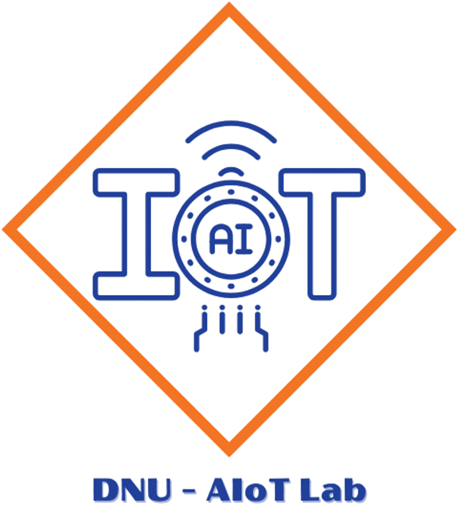

# HỆ THỐNG GIÁM SÁT VÀ PHÂN TÍCH HÀNH ĐỘNG TÉ NGÃ

<p align="center">
  
  
</p>

<div align="center">

[](https://www.facebook.com/DNUAIoTLab)
[](https://fitdnu.net/)
[](https://dainam.edu.vn)

</div>

## 🌟 Giới thiệu

Hệ thống giám sát và phân tích hành động té ngã là một dự án tích hợp giữa phần cứng (**ESP32, MPU6050**) và phần mềm (**Python, Flask, AI**) để phân tích hành động té ngã. Hệ thống thu thập dữ liệu từ cảm biến, gửi đến **ESP32**, xử lý và truyền qua HTTP đến máy chủ. **Dữ liệu sẽ được lưu trữ và phân tích bằng mô hình học sâu CNN + LSTM** để nhận diện hành động. Kết quả hiển thị trên giao diện web và gửi cảnh báo qua **Telegram**.

## 🚀 Chức năng chính

1. **Thu thập dữ liệu:** ESP32 đọc dữ liệu từ MPU6050.
2. **Nhận diện té ngã:** Xử lý dữ liệu bằng thuật toán CNN + LSTM.
3. **Lưu trữ dữ liệu:** Ghi vào file CSV trên máy chủ.
4. **Hiển thị kết quả:** Web Server cập nhật dữ liệu theo thời gian thực.
5. **Gửi cảnh báo:** Khi phát hiện té ngã, hệ thống gửi thông báo đến Telegram.

---

## 🚀 Hướng dẫn cài đặt và chạy hệ thống

### 1️⃣ Chuẩn bị phần cứng
    1. Kết Nối **MPU6050** với **ESP32** qua giao thức I2C.
    2. Cấp nguồn điện cho **ESP32** để thu dữ liệu.

### 2️⃣ Cài đặt thư viện Python
Cài đặt Python 3 nếu chưa có, sau đó cài đặt các thư viện cần thiết bằng pip.
```bash
pip install numpy tensorflow flask pandas matplotlib requests
```

### 3️⃣ Cài đặt phần mềm
#### **📌 Ở file Thu_du_lieu**
    1. Mở **Arduino IDE** hoặc **PlatformIO**.
    2. Cài đặt thư viện cần thiết.
    3. Cập nhật thông tin WiFi.
    4. Nạp code vào ESP32.
    5. Mở Serial Monitor để xem địa chỉ IP.
    6. Dùng trình duyệt truy cập vào địa chỉ IP của ESP32.
    7. Trang web server cho phép người dùng bắt đầu/dừng ghi dữ liệu với nhãn hành động cụ thể. Dữ liệu cảm biến cũng được hiển thị theo thời gian thực trên web. Khi bộ đệm đầy, dữ liệu được ghi vào file để tối ưu hiệu suất. Chúng ta sẽ tải file CSV qua nút "Download" trên web.

#### **📌 Trên file Xu_ly_du_lieu**
    1. Đọc dữ liệu từ file CSV.
    2. Lọc các hoạt động hợp lệ.
    3. Chuẩn hóa dữ liệu.
    4. Mã hóa nhãn hoạt động.
    5. Tạo cửa sổ trượt (Sliding Window).
    6. Xử lý mất cân bằng dữ liệu (SMOTE).
    7. Lưu dữ liệu đã cân bằng.
    8. Kiểm tra số lượng mẫu theo từng nhãn sau khi cân bằng.

#### **📌 Truc_quan_hoa_du_lieu**
    1. Đọc dữ liệu từ file CSV.
    2. Hiển thị từng biểu đồ theo từng loại hành động. 

#### **📌 Huấn luyện mô hình CNN + LSTM**
    1. Huấn luyện trên Google Colab.
    2. Thực hiện các bước huấn luyện mô hình như file "tranining model.txt".
    3. Lưu mô hình "fall_detection_model.h5" đã huấn luyện vào folder "test" để thực nghiệm đánh giá kết quả.

#### **📌 Chạy hệ thống**
1. **Chạy esp32.ino**
    - Mở **Arduino IDE** hoặc **PlatformIO**.
    - Cài đặt các thư viện cần thiết.
    - Cập nhật thông tin WiFi.
    - Nạp code vào ESP32.
    - Dữ liệu được gửi đến server Flask (http://192.168.137.1:5000/sensor) bằng HTTP POST, nhận phản hồi từ server và hiển thị lên Serial Monitor. 

2. **Chạy flask_server.py** trên máy tính.
    - Cài đặt các thư viện cần thiết.
    - Chạy code "python flask_server.py"
    - Dùng trình duyệt truy cập vào (http://127.0.0.1:5000)
    - Hiển thị giao diện web: trạng thái mới nhất từ cảm biến và biểu đồ cảm biến cập nhật dữ liệu theo thời gian thực.
    - Sau đó "Nhận cảnh báo" khi té ngã qua Telegram.


## 🛠️ CÔNG NGHỆ SỬ DỤNG

<div align="center">

### 📡 Phần cứng


[]()


### 🖥️ Phần mềm
[]()
[]()


</div>

## 🛠️ Yêu cầu hệ thống

### 🔌 Phần cứng
- **ESP32** (hoặc board tương thích) với **MPU6050**.
- **Cáp USB** để kết nối ESP32 với máy tính.
- ⚠️ **Lưu ý:** Mặc định mã nguồn ESP32 trong `esp32.ino` sử dụng cổng `COM4`. Nếu ESP32 của bạn sử dụng cổng khác, hãy thay đổi biến `SERIAL_PORT` trong `flask_serverserver.py`.

### 💻 Phần mềm
- **Python 3+**
- **⚡ ESP32** để thu dữ liệu từ cảm biếnbiến.

### 📦 Các thư viện Python cần thiết
Cài đặt các thư viện bằng lệnh:

    pip install numpy as np, 
    pip install tensorflow as tf
## 🧮 Bảng mạch

### 🔩 Kết nối phần cứng:


### ⛓️‍💥 Hướng dẫn cắm dây
| Thiết bị        | Chân trên thiết bị | Kết nối ESP32ESP32 | Ghi chú                         |
|-----------------|-------------------|---------------------|---------------------------------|
| Breadboard      | -                 | -                   | Dùng để kết nối linh kiện       |
| MPU6050MPU6050   | VCC, GND, SCL, SDA | VCC → 3.3V, GND → GND, SCL → GPIO22, SDA → GPIO21 | Kết nối cảm biến gia tốc MPU6050|
|ESP32     | -                 | -                   | Vi điền khiển chínhchính |
| 5 dây điện      | -                 | -                   | Dùng để nối các linh kiện       |

## 🚀 Hướng dẫn cài đặt và chạy hệ thống.
1️⃣ Chuẩn bị phần cứng
    1. Kết Nối 
    **MPU6050** với **ESP32** qua giao thức I2C.
    2. Cấp nguồn điện cho **ESP32** để thu dữ liệu.

2️⃣ Cài đặt thư viện Python. 

Cài đặt Python 3 nếu chưa có, sau đó cài đặt các thư viện cần thiết bằng pip.

### 3️⃣ Cài đặt phần mềm  

#### 📌 Thu_du_lieu  
1. Mở **Arduino IDE** hoặc **PlatformIO**.  
2. Cài đặt thư viện cần thiết.  
3. Cập nhật thông tin **WiFi**.  
4. Nạp code vào **ESP32**.  
5. Mở **Serial Monitor** để xem địa chỉ IP.  
6. Dùng trình duyệt truy cập vào địa chỉ IP của ESP32.  
7. Trang **web server** hiển thị dữ liệu theo thời gian thực và cho phép **bắt đầu/dừng ghi dữ liệu**.  
8. Khi bộ đệm đầy, dữ liệu được ghi vào file để tối ưu hiệu suất.  
9. Tải file **CSV** qua nút `"Download"` trên web.  

#### 📌 Xu_ly_du_lieu  
1. Đọc dữ liệu từ file **CSV**.  
2. Lọc các hoạt động hợp lệ.  
3. Chuẩn hóa dữ liệu.  
4. Mã hóa nhãn hoạt động.  
5. Tạo **cửa sổ trượt (Sliding Window)**.  
6. Xử lý mất cân bằng dữ liệu (**SMOTE**).  
7. Lưu dữ liệu đã cân bằng.  
8. Kiểm tra số lượng mẫu theo từng nhãn sau khi cân bằng.  

#### 📌 Truc_quan_hoa_du_lieu  
1. Đọc dữ liệu từ file **CSV**.  
2. Hiển thị biểu đồ theo từng loại hành động.  

#### 📌 Huấn luyện mô hình **CNN + LSTM**  
1. Huấn luyện trên **Google Colab**.  
2. Thực hiện theo hướng dẫn trong `"training model.txt"`.  
3. Lưu mô hình **"fall_detection_model.h5"** vào folder `"test"` để đánh giá kết quả.  

#### 📌 Chạy hệ thống  
1. Tải mô hình đã huấn luyện.  
2. Nhận dữ liệu từ **ESP32**.  
3. Dự đoán hành động và hiển thị kết quả.  

## ⚙️ Cấu hình & Ghi chú

1. Cổng ESP32: 
- Mặc định sử dụng COM55. 
### Cấu hình Telegram trong `flask_server.py`  
1. Cập nhật thông tin **Telegram Bot**:  
   - `TELEGRAM_BOT_TOKEN`: Token của bot Telegram.  
   - `TELEGRAM_CHAT_ID`: Mã ID của tài khoản Telegram.  

3. Thời gian gửi tin nhắn thông báo: cập nhật hành động ngã mới nhất sau sau 2 giây.
4. Môi trường mạng: 
- Thiết bị esp32 cần kết nối cùng mạng với máy chủ.

## 📰 Poster


## 🤝 Đóng góp
Dự án được phát triển bởi 4 thành viên:

| Họ và Tên              | Vai trò                  |
|------------------------|--------------------------|
| Phạm Thị Hồng Ngọc     | Phát triển toàn bộ mã nguồn, train model, kiểm thử, biên soạn tài liệu Overleaf, Poster Powerpoint triển khai dự án và thực hiện video giới thiệu.|
| Nguyễn Đức ThườngThường| Hỗ trợ Poster, Powerpoint, thuyết trình, hỗ trợ bài tập lớn |
| Nguyễn Đào Nguyên Giáp | Thuyết trình, hỗ trợ bài tập lớn.  |
| Nguyễn Hải Phong       | Hỗ trợ bài tập lớn. |

© 2025 NHÓM 3, CNTT16-04, TRƯỜNG ĐẠI HỌC ĐẠI NAM
